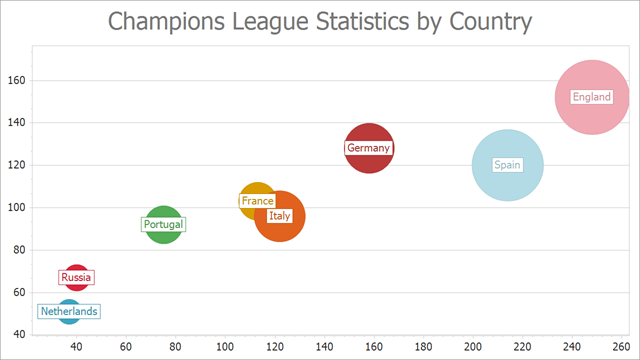

# Chart Control for WinForms - How to Create a Bubble Chart

The following example demonstrates how to create a [Bubble](https://docs.devexpress.com/WindowsForms/5212/controls-and-libraries/chart-control/series-views/2d-series-views/point-and-line-series-views/bubble-chart?p=netframework) chart at runtime.

Note that the Bubble series view type is associated with the [XY-Diagram](https://docs.devexpress.com/WindowsForms/5908/controls-and-libraries/chart-control/diagram/xy-diagram?p=netframework) type, and you should cast your [diagram](https://docs.devexpress.com/WindowsForms/DevExpress.XtraCharts.ChartControl.Diagram?p=netframework) object to this type, in order to access its specific options.

## Files to Look At

* [Form1.cs](./CS/Series_BubbleChart/Form1.cs) (VB: [Form1.vb](./VB/Series_BubbleChart/Form1.vb))

## Documentation 

* [Bubble Chart](https://docs.devexpress.com/WindowsForms/5212/controls-and-libraries/chart-control/series-views/2d-series-views/point-and-line-series-views/bubble-chart)
* [Chart Control - 2D Series Views](https://docs.devexpress.com/WindowsForms/2960/controls-and-libraries/chart-control/series-views/2d-series-views)
* [Chart Control Examples - Creating Charts](https://docs.devexpress.com/WindowsForms/2458/controls-and-libraries/chart-control/examples#creating)

## More Examples

* [How to keep proportional size for Bubbles corresponding to different series](https://github.com/DevExpress-Examples/how-to-keep-proportional-size-for-bubbles-corresponding-to-different-series-t180335)
